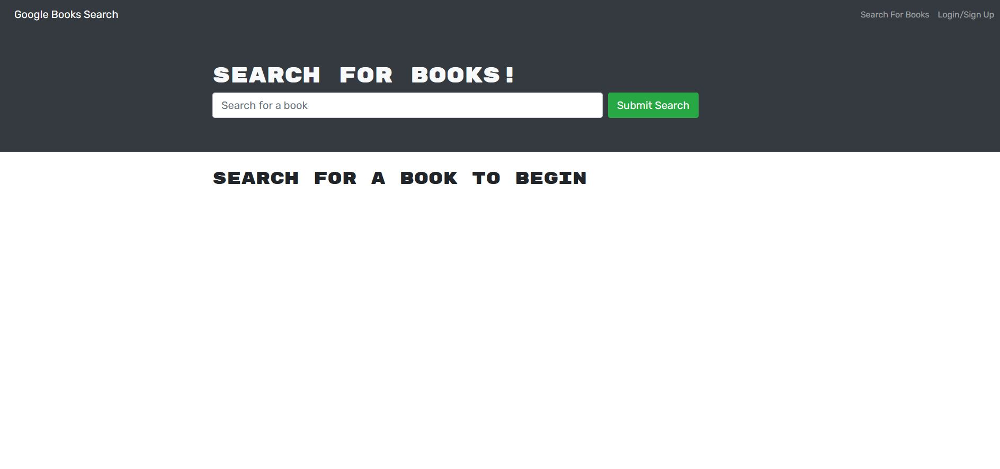
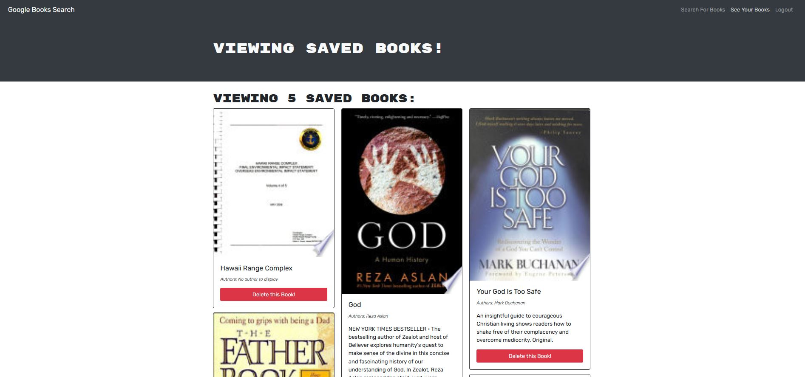
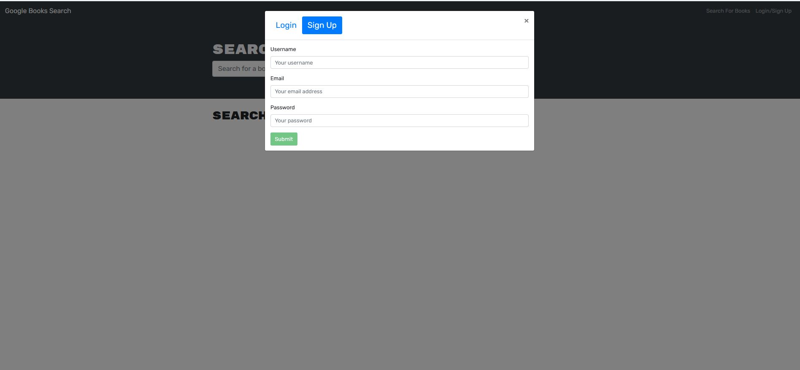

# book-search-engine-MERN

## Description :
Book-search-engine is a MERN ( MongoDB, Express.js, React.js, Node.js) based Full Stack application. 
This application is using components and JSX in React for Front End client side while Node, Express and MongoDB database on server side. 

* The requirement from the client was as below:
```
AS AN avid reader
I WANT to search for new books to read
SO THAT I can keep a list of books to purchase

GIVEN a book search engine
WHEN I load the search engine
THEN I am presented with a menu with the options Search for Books and Login/Signup and an input field to search for books and a submit button
WHEN I click on the Search for Books menu option
THEN I am presented with an input field to search for books and a submit button
WHEN I am not logged in and enter a search term in the input field and click the submit button
THEN I am presented with several search results, each featuring a book’s title, author, description, image, and a link to that book on the Google Books site
WHEN I click on the Login/Signup menu option
THEN a modal appears on the screen with a toggle between the option to log in or sign up
WHEN the toggle is set to Signup
THEN I am presented with three inputs for a username, an email address, and a password, and a signup button
WHEN the toggle is set to Login
THEN I am presented with two inputs for an email address and a password and login button
WHEN I enter a valid email address and create a password and click on the signup button
THEN my user account is created and I am logged in to the site
WHEN I enter my account’s email address and password and click on the login button
THEN I the modal closes and I am logged in to the site
WHEN I am logged in to the site
THEN the menu options change to Search for Books, an option to see my saved books, and Logout
WHEN I am logged in and enter a search term in the input field and click the submit button
THEN I am presented with several search results, each featuring a book’s title, author, description, image, and a link to that book on the Google Books site and a button to save a book to my account
WHEN I click on the Save button on a book
THEN that book’s information is saved to my account
WHEN I click on the option to see my saved books
THEN I am presented with all of the books I have saved to my account, each featuring the book’s title, author, description, image, and a link to that book on the Google Books site and a button to remove a book from my account
WHEN I click on the Remove button on a book
THEN that book is deleted from my saved books list
WHEN I click on the Logout button
THEN I am logged out of the site and presented with a menu with the options Search for Books and Login/Signup and an input field to search for books and a submit button  
```

## Languages and other components used : 
```
   * npm (node package manager) 
   * React
   * React-router
   * Node.js
   * Express.js
   * MongoDB database
   * apollo-server
   * apollo-client
   * graphQL
   * MongoDb Atlas
   * Heroku App
   * github
```

## How to install : 

 To install the application in your computer follow the steps below: 

   Clone the repository in your computer :
    - open the command line and go to the directory where you want to clone the repository.
    - then clone the repo by typing : " git clone git@github.com:miraj00/book-search-engine-MERN.git "

Here is a list of commands that were used while building this project :
```
- npm install
- npm run seed
- npm install mongoose
- npm install bcrypt --save
- mongod ( to start mongoDB server in initial phase )
- npm i apollo-server-express graphql
- npm run watch ( to run apollo server )
- npm install jsonwebtoken
- npx create-react-app client ( to setup react )
- npm start ( to start client server initially )
- npm i @apollo/cleint graphql
- npm install -D concurrently
- npm install react-router-dom
- npm install jwt-decode
- npm install apollo-boost
- heroku create
- git push heroku main
- git add .
- git commit -m ________
- git push origin main
```

### How to Use the application : 

Once cloned locally and dependencies are installed, Run " npm run develop " command in command prompt to start both servers with a single command ( It should automatically open the browser and direct to http://localhost:3000/ ).  

## Below is the screenshot and Deployed application of the Project as per client request ## 





### Deployed Sites ##

[Please click here to see deployed code on Github](https://github.com/miraj00/book-search-engine-MERN)

[Please click here to see deployed application on Heroku App](https://secret-wave-99591.herokuapp.com/)